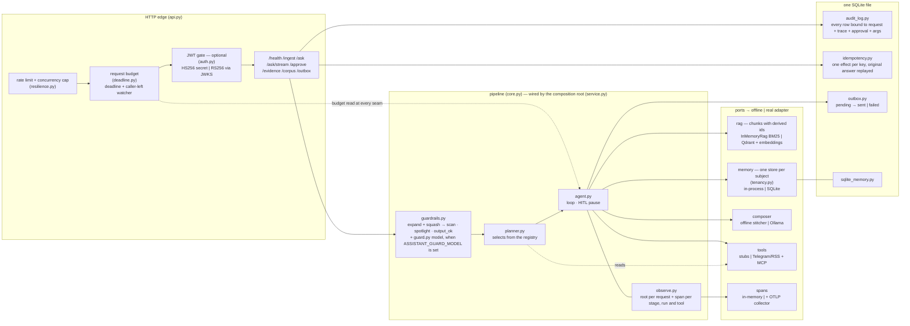
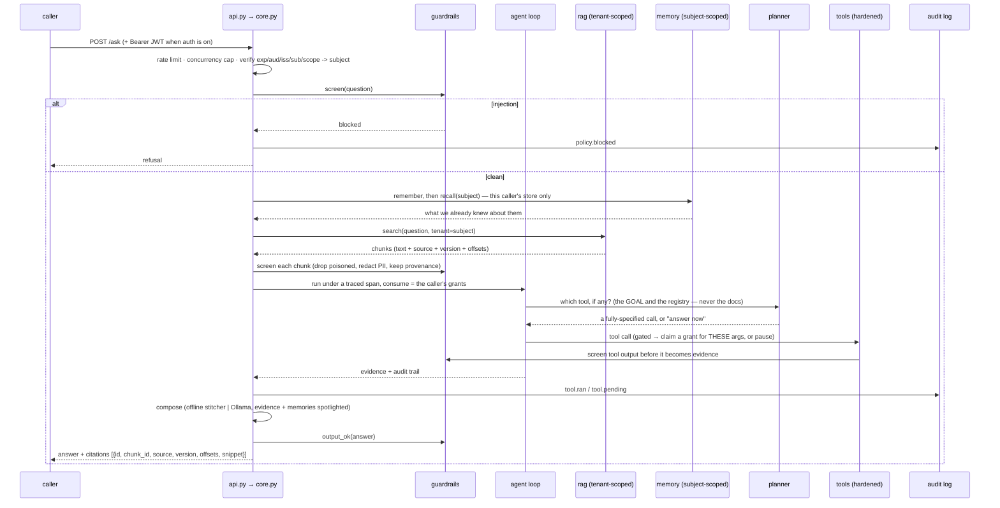

# Architecture — the composed assistant

Two diagrams: what the pieces are (and which tier each one swaps at), and what one
request actually goes through (and where the trust boundaries sit). Decisions with
alternatives and consequences live in [`adr/`](adr/); threats in
[`THREAT-MODEL.md`](THREAT-MODEL.md); incidents in [`RUNBOOK.md`](RUNBOOK.md).

## Components and tiers

Every port has two adapters: an offline one (default — zero keys, deterministic,
what the fast tests drive) and a real one (one env var each — what the composed
stack runs). The service code cannot tell which is plugged in; that indifference
is enforced by the tests, not just claimed.

## One request, end to end

The trust rule that shapes the whole flow: **content is never trusted because of
where it was stored, only because of where it came from** — so user input,
retrieved documents and tool output are each screened at their own boundary, and
approval is trusted state (a `/approve` grant record bound to caller, arguments
and expiry), never text. Documents are screened once more on the way *in*
(`/ingest`), so a poisoned page is never written rather than merely never read,
and PII is redacted before it reaches disk (ADR-0010).

The same pipeline serves `/ask/stream` as SSE, and the output gate is the same
gate: `output_gate.py` holds a window back so a chunk reaching the client has
already been screened, rather than apologizing for one that was not. The window
is derived from the output patterns themselves — each declares the longest span
it can match, and the gate takes the maximum — because the earlier fixed 256
characters were a guess that an unbounded email pattern outgrew (ADR-0006). A
stream that dies mid-answer ends with `truncated: true` rather than being
presented as complete. A replayed `/approve` is deduplicated by `Idempotency-Key`, and a
grant is claimed atomically by the run that spends it, so "approved once" means
"this caller, this call, fires once" (ADR-0003).

Two of the arrows above carry more weight than their size suggests. The planner
reads the **registry**, not a list of tool names, so a tool discovered from the
MCP server at boot is selectable without a code change — behind an approval,
because a tool that arrived without review is not a tool to run on a planner's
say-so. The server's `readOnlyHint` travels with it and can only make the gate
stricter; the single thing that opens one is
`ASSISTANT_MCP_READONLY_ALLOWLIST`, which is local and operator-owned. It reads the
**goal**, not the retrieved documents, so a poisoned corpus has no path to a
tool call at all (ADR-0007). Memory recall is scoped to the caller's own store
rather than filtered after the fact, which is why one person's remembered
preference cannot surface in another's answer (ADR-0008).

Recalled memory is a **third class of evidence**, not decoration on the other
two. When it is the only evidence and it bears on the question — same
content-word filter documents get — it answers, attributed ("you told me
earlier") and uncited, because a memory is not a document. The composers used to
abstain there while the recalled fact sat in the response payload beside the
refusal. `grounding` on the response names the class the answer stands on
(`documents`, `tools`, `memory`, `none`), so a reader can tell "the handbook
says" from "you said" without inspecting the citations to infer it.

Every arrow in that diagram is also a span. One root per request
(`assistant.request` over HTTP, `assistant.pipeline` when core is driven
directly) with a child per stage — auth, screen, memory, retrieval, the agent
run, compose, the output gate — so a slow request resolves to a stage rather than
to a shrug. The root names the system that answered (`service.name` on a
Resource, the model, and a prompt version *hashed from the prompt's own source*),
the retrieval span records what came back *and* what survived screening, and the
compose span carries tokens and cost from the same meter the CI cost gate reads
(ADR-0011). One request id ties the span, the response body and the
`x-request-id` header together.

What retrieval hands back is a **chunk**, not a string: text plus the source it
came from, a version hash of that source, and the character span it occupies.
That is what makes the citation on an answer checkable — `GET /evidence/{id}`
resolves it back to the exact text — and what makes `DELETE /corpus/{source}`
possible at all, since you cannot delete by prose. Chunk ids are derived from
`(tenant, source, ordinal)` rather than from a counter, so re-running the loader
updates the corpus instead of duplicating it, and an edit replaces a paragraph
instead of shelving the old one beside the new one. The embedder is injected and
its dimension measured, so `ASSISTANT_EMBED_MODEL` swaps the offline hash vector
for real semantic recall without a config change anywhere else (ADR-0012) — and
the collection is named after the embedder and its width, because Qdrant checks
dimensions and not meaning, so two 768-wide models write into each other's index
without an error anywhere.

The Qdrant search itself runs both arms of phase 2: a dense prefetch and a sparse
one, fused by Qdrant's own RRF rather than in Python, because an order number
carries no meaning for an embedder to place and a synonym carries no token for a
keyword index to match. `ASSISTANT_MIN_SCORE` puts a floor under the dense
similarity, which is what lets the composer abstain — vector search returns its
three least-unrelated documents for a question about something absent from the
corpus, and without a floor those become evidence. `ASSISTANT_RERANK_MODEL` adds
a cross-encoder over the fused candidates, off by default and degrading to plain
retrieval when the optional dependency is missing. `/health` names all three
(`tier.embed`, `tier.retrieval`, `tier.rerank`), because a stack running on the
hash vector is indistinguishable from a working one by every other probe.

Everything in that sequence runs inside **one budget**. A request carries a
deadline and a "the caller left" flag together (`deadline.py`), both installed at
the HTTP edge because that is the only layer that knows either fact, and both read
through a ContextVar at the seams: between pipeline stages, before each retry, and
before each streamed frame. That is what stops per-layer timeouts composing by
addition — a call made with four seconds of request budget left gets four seconds,
whatever its own policy says — and what stops a service generating tokens for a
caller who closed the tab. Running out of time answers 504, because somebody
should look; a caller who left answers 499, because nobody is there to read it
(ADR-0013).

The same ADR governs what happens when a request is *retried*. Every mutating
route — `/ingest`, `DELETE /corpus/{source}`, `/approve` — takes an
`Idempotency-Key` and replays the **original answer**, not a receipt, with the key
released if the operation failed so a transient error does not become a permanent
one. And every irreversible tool call writes its intent to an outbox *before* it
runs: `pending` committed first, `sent` or `failed` after. A crash mid-send then
leaves a question `GET /outbox` can answer, rather than a message that went out
and nothing that remembers it.

Every arrow into `guardrails` above is the *same object*, injected into the
pipeline by the composition root rather than imported at each call site. That is
what makes `ASSISTANT_GUARD_MODEL` a one-line decision: turning the guard model
on hardens the question, the retrieved documents, the tool output and the
ingested documents together, instead of covering the channel someone remembered
(ADR-0010). `/health` reports which screen is actually in front of the caller.
