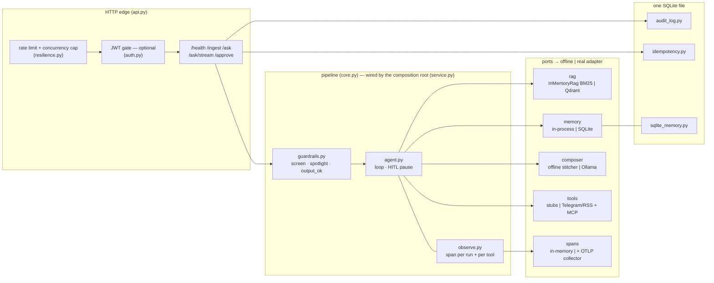
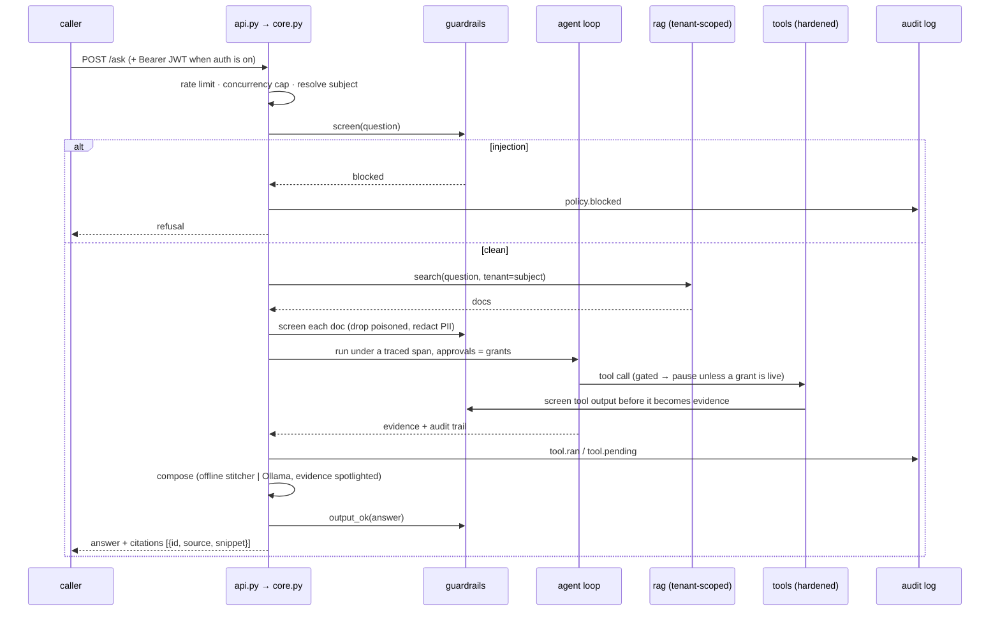

# Architecture — the composed assistant

Two diagrams: what the pieces are (and which tier each one swaps at), and what one
request actually goes through (and where the trust boundaries sit). Decisions with
alternatives and consequences live in [`adr/`](adr/); threats in
[`THREAT-MODEL.md`](THREAT-MODEL.md); incidents in [`RUNBOOK.md`](RUNBOOK.md).

## Components and tiers

Every port has two adapters: an offline one (default — zero keys, deterministic,
what the fast tests drive) and a real one (one env var each — what the composed
stack runs). The service code cannot tell which is plugged in; that indifference
is enforced by the tests, not just claimed.

## One request, end to end

The trust rule that shapes the whole flow: **content is never trusted because of
where it was stored, only because of where it came from** — so user input,
retrieved documents and tool output are each screened at their own boundary, and
approval is trusted state (`/approve` grants), never text.

The same pipeline serves `/ask/stream` as SSE — the output gate runs on the
accumulated text and the `done` event carries the verdict. A replayed `/approve`
is deduplicated by `Idempotency-Key`, and each grant is consumed by the run that
uses it, so "approved once" means "fires once".
